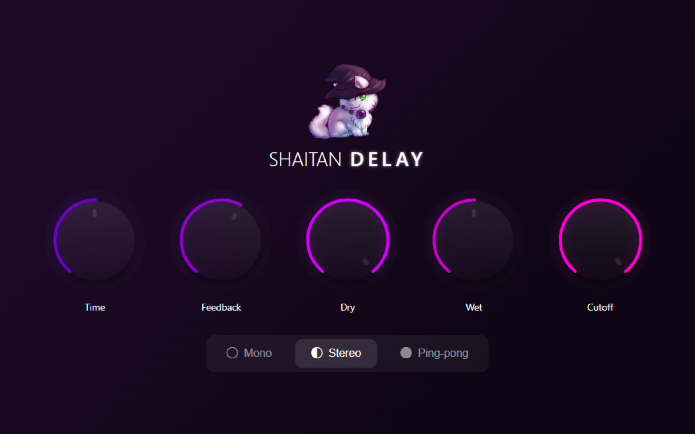

<div align="center">


# Shaitan DELAY (VST3 Win/Mac)

[](package.json)
[](#supported-formats)
[](#supported-formats)
[](https://elementary.audio)
[](https://buymeacoffee.com/resonaura)

Delay plugin capable of creating magic ✨🐾\
The latest builds of our plugin you can download **from our Telegram channel**: [@shaitandelay](https://shaitandelay.t.me/)


<p align="center">
  
</p>

<br/>
<br/>
</div>
<br/>

<h2>

&nbsp;Getting started
</h2>

```
npm install
npx elem-copy-binaries
npm run make-ssl
```

<h2>

&nbsp;How to make a build?
</h2>

You can create a build using this command:
```
npm run build
```
The result will be saved to `dist` folder

> **Note:** If you use Windows, then you can immediately install the resulting build using the command `npm run win-install` (if the plugin has not been installed before) or `npm run win-update` (if the plugin has already been installed before)

<br/>
<h2>

&nbsp;How to install ZIP-build? (Windows)
</h2>

-   Unpack the zip file of VST3 build
-   Run `install.bat` if the plugin has not been installed before, or `update.bat` if it has already been installed
-   To uninstall the plugin from the system, use this `uninstall.bat`

<br/>

<h2>

&nbsp;Available Scripts (Windows / Mac)
</h2>

### `npm start`

Runs the VST3 in the development mode.
<br/>

### `npm test`

Launches the test runner in the interactive watch mode.\
See the section about [running tests](https://facebook.github.io/create-react-app/docs/running-tests) for more information.
<br/>

### `npm run build`

Builds complete VST-plugin to the `dist` folder.
<br/>

### `npm run build-ui`

Builds the plugin UI to the `build` folder.\
It correctly bundles React in production mode and optimizes the build for the best performance.
<br/>

### `npm run build-vst`

Makes VST3 using _already builded_ UI from `build` to `dist` folder.
<br/>

### `npm run make-zip`

Makes ZIP from last build and saves it to `dist` folder
<br/>

### `npm run make-ssl`

Makes SSL to `.cert` folder (**required** before first build)
<br/>

### `npm run publish`

Publishes last build from `dist` to Telegram\
\
Arguments:\
`--token` - [Telegram API](https://core.telegram.org/bots/api) token\
`--chatID` - [Telegram](https://telegram.org) chat id\
`--type` (can be `default` or `channel`) - [Telegram](https://telegram.org) type of chat (adds '-' to `chatID` when `channel`)

> **Note:** you can also create your local `publish.config.json` so that you don't have to write all the parameters manually every time\
\
Example:

```json
{
    "token": "YOUR_TELEGRAM_TOKEN",
    "chatID": "YOUR_CHAT_ID"
}
```

\
... And then only the `npm run publish` command without arguments will be enough to publish

<br/>

<h2>

&nbsp;Available Scripts (Windows)
</h2>

### `npm run win-uninstall`

The command to uninstall _builded_ VST3 plugin on Windows
> 🛡️ Admin rights required

<br/>

### `npm run win-update`

The command to update _builded_ VST3 plugin on Windows
> 🛡️ Admin rights required

<br/>

### `npm run win-build-install`

The command to build and install VST3 plugin on Windows
> 🛡️ Admin rights required

<br/>

### `npm run win-build-install-publish`

The command to build, install and publish VST3 plugin on Windows
> 🛡️ Admin rights required

<br/>

### `npm run win-build-update`

The command to build and update VST3 plugin on Windows
> 🛡️ Admin rights required

<br/>

### `npm run win-build-update-publish`

The command to build, update and publish VST3 plugin on Windows
> 🛡️ Admin rights required

